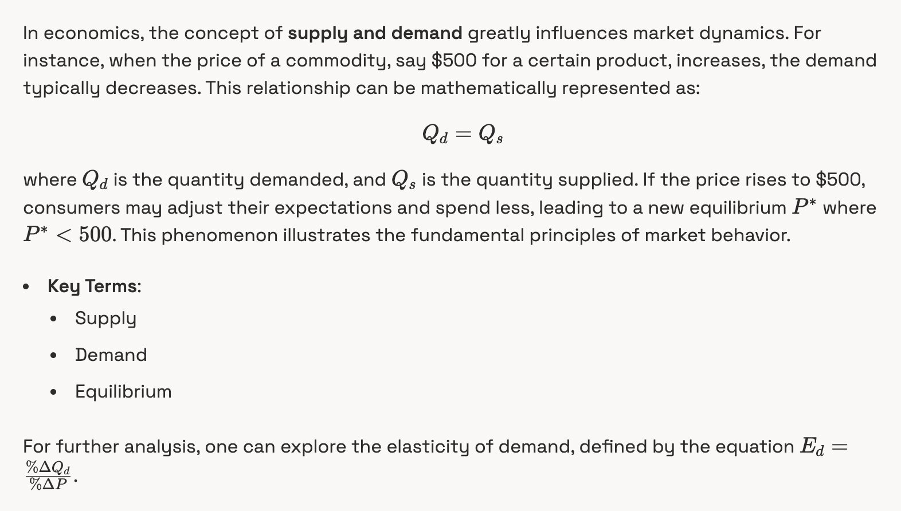

# SmarTeX

An all-in-one TS package to preprocess streamed LaTeX of any delimiter, currency, and paragraph text for rendering

<p align="center">

</p>

## Who is this for

Anyone who has wanted to render LaTex, currency, and prose (all of which are typical in LLM responses), but has faced issues with rendering due to the lack of a comprehensive solution that can handle all three seamlessly.

## Installation

```bash
pnpm install smartex
```

## Usage

```typescript
import preprocessLatex from 'smartex';

const latex = 'The price is $100 and the equation is \\(E=mc^2\\).';
const processed = preprocessLatex(latex);
console.log(processed);
```

or, if using Streamdown/another streaming markdown parser:

```tsx
import { Streamdown } from 'streamdown';
import preprocessLatex from 'smartex';

const latex = 'The price is $100 and the equation is \\(E=mc^2\\).';
const processed = preprocessLatex(latex);

<Streamdown>{processed}<Streamdown>;
```

## License

MIT License
